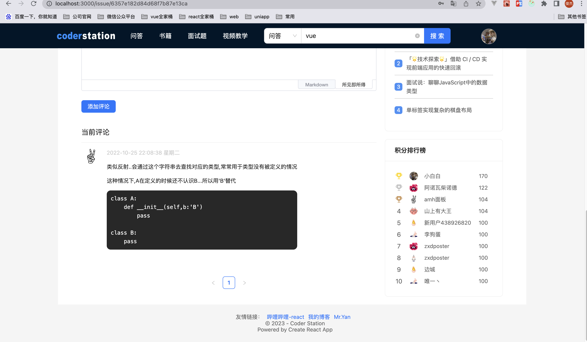
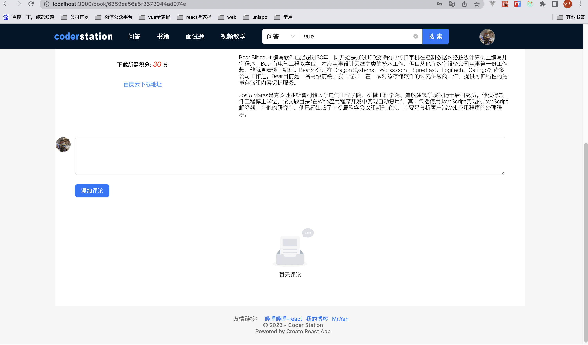
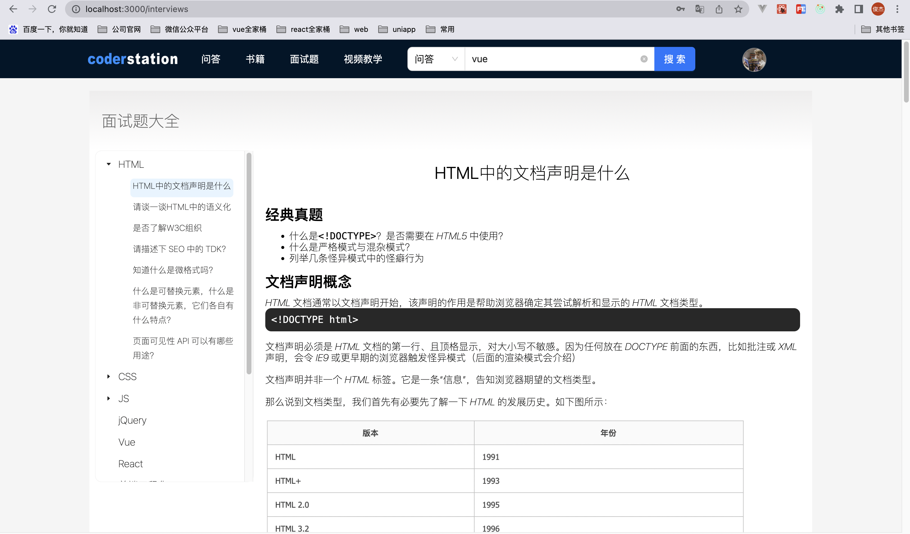

# 页面展示
 
codeStation前台系统共分为8个页面，分别是：

**问答展示页面**

**问答详情展示页面**

**添加问答展示页面**

**问答搜索展示页面**

**书籍展示页面**

**书籍详情展示页面**

**书籍搜索展示页面**

**面试题展示页面**

**个人中心展示页面**

**登录注册展示页面**

\*其中针对addIssue和personal俩个页面做了路由拦截，当用户没有登录时，直接更改浏览器地址进行访问该页面时，会拦截页面提醒用户登录账号即可查看\*

